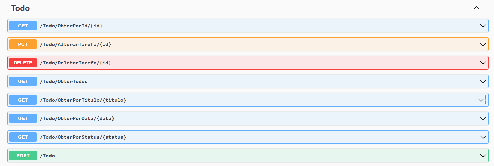

# **To Do List**     ->  C#   -     ASP.NET  :spiral_notepad: 

Desafio de Projeto C# PRO 


## Desafio de projeto
Neste projeto foram utilizados conhecimentos adquiridos no módulo de API e Entity Framework, da trilha .NET da DIO.
Agradecimentos ao professor do curso e a toda equipe DIO.

## Contexto
Construir um sistema gerenciador de tarefas, onde você pode cadastrar uma lista de tarefas que permitirá organizar melhor a sua rotina.

Essa lista de tarefas possui um CRUD, ou seja, permite a você obter os registros, criar, salvar e deletar esses registros.

A sua aplicação é do tipo Web API (Em breve postarei uma versão contendo um Front-end, utilizando o padrão MVC do ASP.NET)

Modelo de Classe principal:


Para facilitar o espelhamento dos modelos em um Banco de dados chamado ToDoList, foi criado e utilizado o recurso "Migrations" do Entity Framework. DB utilizado é o SQLServer.
Basta fazer um "update" no console para espelhar em seu banco local (caso seja necessário, realize os ajustes no arquivo de configuração)


## Métodos esperados
Métodos conforme a seguir:


**Swagger**





**Endpoints**


| Verbo  | Endpoint                      | Parâmetro | Body          |
| ------ | ----------------------------- | --------- | ------------- |
| GET    | /Todo/ObterPorId/{id}         | id        | N/A           |
| PUT    | /Todo/AlterarTarefa/{id}      | id        | Schema Tarefa |
| DELETE | /Todo/DeletarTarefa/{id}      | id        | N/A           |
| GET    | /Todo/ObterTodos              | N/A       | N/A           |
| GET    | /Todo/ObterPorTitulo/{titulo} | titulo    | N/A           |
| GET    | /Todo/ObterPorData/{data}     | data      | N/A           |
| GET    | /Todo/ObterPorStatus/{status} | status    | N/A           |
| POST   | /Todo                         | N/A       | Schema Tarefa |

Esse é o schema (model) de Tarefa, utilizado para passar para os métodos que exigirem

```json
{
  "id": 0,
  "titulo": "string",
  "descricao": "string",
  "data": "2022-06-08T01:31:07.056Z",
  "status": "Pendente"
}
```
